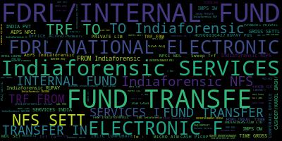

# Clustering Bank Transactions using Text Descriptions


## Introduction

This work is inspired by Ravindra Reddy Tamma's article named [Real-World Machine Learning Case Study: Clustering Transactions Based on Text Descriptions](https://www.analyticsvidhya.com/blog/2020/07/machine-learning-study-clustering-transactions-text-descriptions/). In this repository, I will replicate the method described in the article on a [Kaggle data set provided by Apoorv Patne](https://www.kaggle.com/apoorvwatsky/bank-transaction-data).

## Dataset

Features included in this dataset are shown as below:

- Account No. - This represents the account number involved in a transaction.
- Date - Date of transaction
- Transaction Details - Transaction narrations in bank statements
- Cheque No. - This indicates the cheque number
- Value Date - Date of completion of a transaction
- Withdrawal Amount - Indicates the amount withdrawn
- Deposit Amount - Indicates the amount deposited
- Balance Amount - Current balance of an account

The feature that mainly used in this repository is **Transaction Details** as we aim to cluster based on texts.

We begin with analysing the dataset. This step can help us recognize frequent words in this dataset and filter some of them as stop words. We get the frequency distribution of unigram, bigram and trigram terms, and draw word cloud graphs of them as follows:


<center>Fig-1 Unigram Word Cloud</center>



<center>Fig-2 Bigram Word Cloud</center>


<center>Fig-3 Trigram Word Cloud</center>

From the above graphs, we can notice that "TRF" which means "transfer" in bank statements are highly frequent. Therefore, we filter out "transfer" and "trf" in our following processes. 

## Preprocessing

Preprocessing includes removing stop words, punctuations and numbers. The set of stop words comes from [NLTK](https://www.nltk.org/) and words that we recognized in the last section. For the punctuations, as it includes some words like "FDRL/INTERNAL" and "FDRL/REAL" which represent bank transformation status, we only remove the punctuations whose neighbours are spaces. The numbers are included in some transferring code, for example, "12345c", "67890c", and we remove the numbers and keep "c" as it may have some specific meanings.

## Identifying the Number of Categories

After finishing the preprocessing, the step comes to identifying the number of categories. We use a topic modelling algorithm named [LDA](https://www.jmlr.org/papers/v3/blei03a) to assign every item (document) to a category. LDA is an unsupervised learning algorithm and a generative probabilistic model which can group text corpus into several categories. However, this algorithm requires the number of categories as input. To determine the number of categories reasonably, we also need topic coherence score to evaluate it. The topic coherence takes the first **n** words in each category to measure the similarity between them. We test the number of categories from 1 to 20 and take the number with the largest topic coherence score as the final number. Similar to the dataset analysis step, we also apply these methods on unigram, bigram and trigram. The results are as follows:


<center>Unigram Topic Coherence Score of the Number of Topics</center>


<center>Bigram Topic Coherence Score of the Number of Topics</center>


<center>Trigram Topic Coherence Score of the Number of Topics</center>

These figures show interesting trends. Unlike ordinary cases whose trend is like a parabola. These graphs have the largest coherence score when the number of categories equals to 1. This may be caused by many overlaps among each item. However, we also notice that another peak appears as the number of categories grows. As we aim to grow the items into different categories, we choose the second peak as the final number of categories in clustering, which are 9 for unigram, 14 for bigram and trigram.

## Clustering

We use K-Means as the clustering algorithm and TF-IDF to vectorize the n-gram terms. TF-IDF is able to involves the importances of each term based on their uniqueness instead of frequency only. This is useful when many words are overlapped.

### 9 Topics and Unigram


<center>Count of Items in 9 Topics and Unigram</center>

From the above figure, we can see that cluster __0__ contains most of the items and others are relatively small. We further study the term frequency and TF-IDF score to study the clustering results.

```
Cluster 0:
| Word              |   Count |
|-------------------+---------|
| Indiaforensic     |    8113 |
| AEPS              |    4372 |
| ACQ               |    3260 |
| SETTL             |    2822 |
| CHQ               |    2599 |
| PRIVATE           |    1907 |
| CASHDEP/GURGAON/  |    1837 |
| RTGS/SBINH/Indfor |    1826 |
| SET               |    1760 |
| NPCI              |    1757 |
Cluster 1:
| Word     |   Count |
|----------+---------|
| INTERNAL |    3262 |
| FUND     |    3262 |
Cluster 2:
| Word          |   Count |
|---------------+---------|
| Indiaforensic |    8752 |
| SERVICES      |    8738 |
| INDIA         |    1608 |
| PVT           |    1608 |
| FRM           |     746 |
| FUND          |       3 |
Cluster 3:
| Word          |   Count |
|---------------+---------|
| SETT          |    4884 |
| Indiaforensic |    4410 |
| --            |    4401 |
| NFS           |    4315 |
| RUPAY         |     569 |
| OXYGEN        |     474 |
| Int.Coll      |      86 |
| :             |      86 |
Cluster 4:
| Word      |   Count |
|-----------+---------|
| CR/RMCPL/ |    5261 |
Cluster 5:
| Word          |   Count |
|---------------+---------|
| FUND          |    8840 |
| FDRL/INTERNAL |    8839 |
Cluster 6:
| Word          |   Count |
|---------------+---------|
| FDRL/NATIONAL |    6262 |
| ELECTRONIC    |    6262 |
| F             |    6262 |
Cluster 7:
| Word    |   Count |
|---------+---------|
| IMPS    |    7963 |
| C       |    6681 |
| OW      |    1748 |
| IW      |    1624 |
| OX      |    1167 |
| O/W     |     467 |
| I/W     |     409 |
| RTN     |     133 |
| RET     |     128 |
| PENALTY |      29 |
Cluster 8:
| Word          |   Count |
|---------------+---------|
| CASHDEP/KAROL |    1903 |
| BAGH/         |    1649 |
| BAGH/LCT      |     254 |
```

```
Cluster 0:
['sweep' 'sweep' 'sweep' 'sweep' 'sweep' 'neft' 'neft' 'irtt' 'irtt'
 'sweep']
Cluster 1:
['internal' 'internal' 'internal' 'fund' 'internal' 'fund' 'internal'
 'fund' 'internal' 'fund']
Cluster 2:
['indiaforensic' 'indiaforensic' 'indiaforensic' 'indiaforensic'
 'indiaforensic' 'indiaforensic' 'indiaforensic' 'indiaforensic'
 'indiaforensic' 'indiaforensic']
Cluster 3:
['oxygen' 'oxygen' 'oxygen' 'oxygen' 'oxygen' 'oxygen' 'oxygen' 'oxygen'
 'oxygen' 'oxygen']
Cluster 4:
['cr' 'cr' 'cr' 'rmcpl' 'cr' 'rmcpl' 'cr' 'rmcpl' 'cr' 'rmcpl']
Cluster 5:
['fund' 'fdrl' 'internal' 'fdrl' 'internal' 'fdrl' 'fdrl' 'internal'
 'fdrl' 'internal']
Cluster 6:
['fdrl' 'electronic' 'fdrl' 'electronic' 'national' 'fdrl' 'electronic'
 'national' 'fdrl' 'electronic']
Cluster 7:
['imps' 'imps' 'imps' 'imps' 'imps' 'imps' 'imps' 'imps' 'imps' 'imps']
Cluster 8:
['lct' 'lct' 'lct' 'lct' 'lct' 'lct' 'lct' 'lct' 'lct' 'lct']
```

From the above term frequency and TF-IDF score, we can see that every cluster has its representative words. When it comes to cluster **2** and **3**, two different types of Indiaforensic transformation is filtered from others. We can see the similar results in other clustering results. Please check out the [Jupyter Notebook](https://github.com/myJSheart/bank_transactions_clustering/blob/master/notebooks/explore_data.ipynb) for more information.

## Conclusions

In this project, we recognize the number of categories using topic modelling and topic coherence. We further cluster them based on text descriptions using K-Means. The result shows that we successfully group them into different categories, especially the minorities. However, for the largest category needs more works to further divide. Some possible works include:

* Filter out some internal code as stop words. Some commonly used shortcuts may be used by many items, these codes should be filtered because it cannot stands for both sides of the transformation.
* Identify some common services provided by the bank. For example, if we can identify more services provided by Indiaforensic, we can cluster them using string match.

